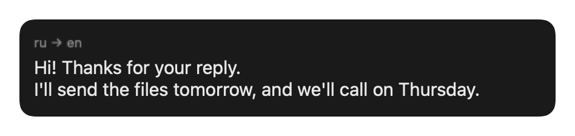
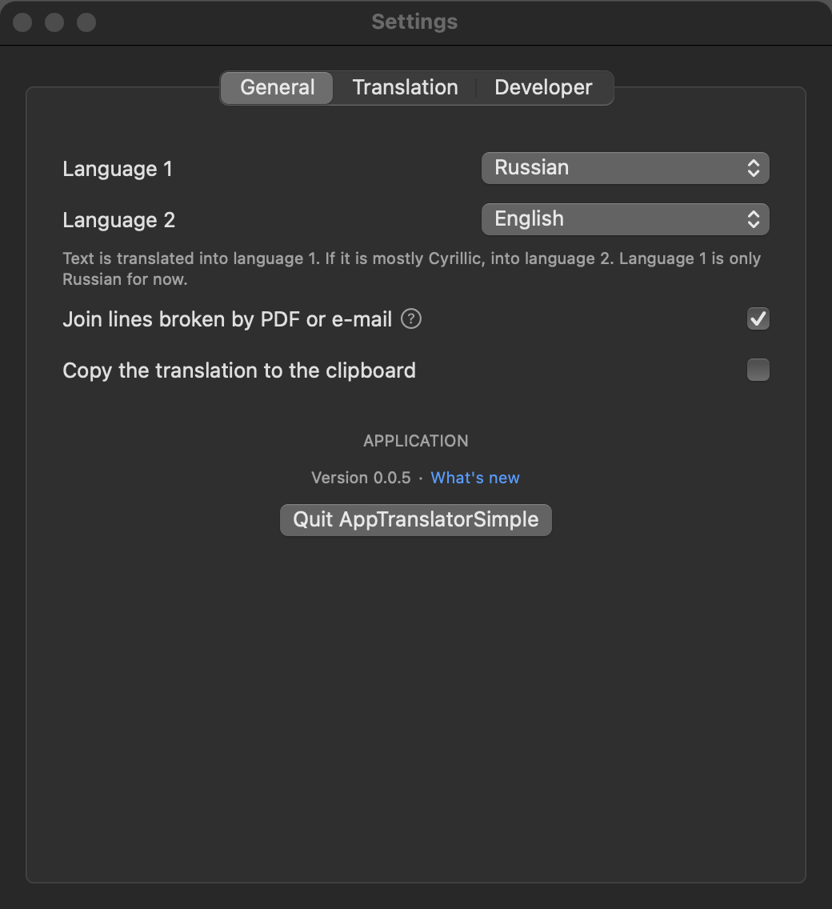
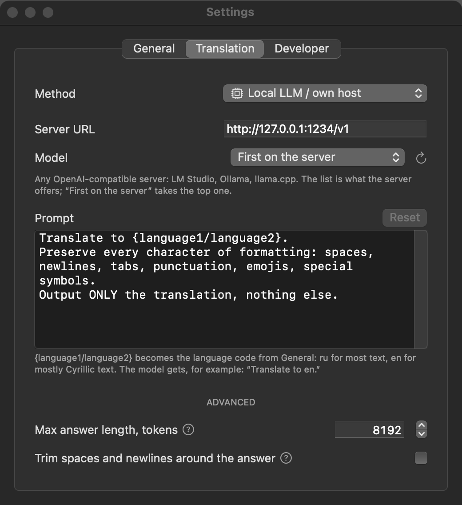
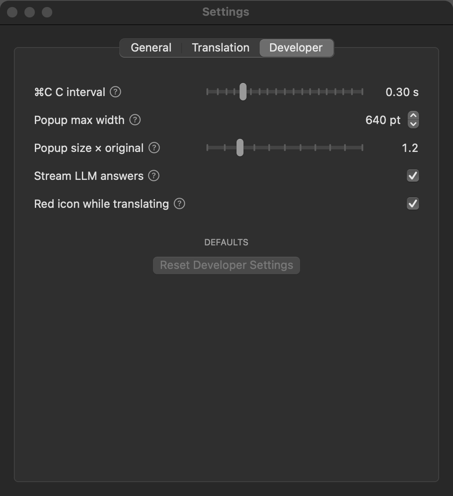

# AppTranslatorSimple


[](LICENSE)
[](https://github.com/NikolaevMikhailRoma/mac-AppTranslatorSimple_n_LLM/releases/latest)
[](https://github.com/NikolaevMikhailRoma/mac-AppTranslatorSimple_n_LLM/releases)



A minimal native macOS menu bar translator. Copy text twice (⌘C C) and the
translation pops up next to the cursor. No Dock icon, no main window.

## Features

- Popup at the cursor on ⌘C C. It opens with the first word and fills in as
  the model writes. ⌘C inside the popup copies the translation (or the
  selected part); optionally it goes to the clipboard on its own.
- The translation direction is picked automatically: text is translated into
  language 1, mostly Cyrillic text into language 2 (Russian and English by
  default; language 2 can be any of 19 languages).
- Lines broken by a PDF or an e-mail are joined before translating, so the
  model gets whole sentences.
- Privacy: no analytics, nothing is collected. Text goes only to the
  translation service you set up. Per-method privacy details: not implemented yet.
- On-device: with a local model the text never leaves your Mac (except when
  you point the app at a remote host).

## Translation methods

| Method | Status |
| --- | --- |
| Local LLM or your own host — any OpenAI-compatible Chat Completions API | ✅ |
| Google Translate API | not implemented |
| DeepL API | not implemented |
| Claude subscription (through Claude Code, no API key) | ✅ |
| macOS built-in Translation | ✅ |

The local LLM method talks to `http://127.0.0.1:1234/v1` (LM Studio's default)
unless you change the server URL in Settings. The model, the prompt and the
maximum answer length are set there too.

Tested with Qwen 3.5 9B in LM Studio (thinking turned off in the model's
settings in LM Studio) on a MacBook Pro M1 Max, 64 GB.

The Claude method uses your Claude plan (Pro, Max, Team or Enterprise) and
counts toward its usage limits. Set it up once in Terminal:

1. Install Claude Code: `curl -fsSL https://claude.ai/install.sh | bash`
   (or `brew install --cask claude-code`).
2. Run `claude` and sign in with your Claude account in the browser.

Then pick it in Settings → Translation, with the model and effort.

## Settings

Menu bar icon → **Settings…**: General (languages, joining lines, copying),
Translation (method, server, model, prompt) and Developer (timings and popup
size — rarely needed).

<p>
  
  
  
</p>

## Run the app (users)

1. Download `AppTranslatorSimple.app.zip` from the [latest release](https://github.com/NikolaevMikhailRoma/mac-AppTranslatorSimple_n_LLM/releases/latest) and unzip it.
2. Move it wherever you like (e.g. Applications).
3. First launch: right-click the app → **Open** (it's ad-hoc signed, not notarized by Apple, so Gatekeeper shows one warning before the app even starts — this is expected, click Open to proceed).
4. Start an OpenAI-compatible server (LM Studio, Ollama, llama.cpp…) with a non-reasoning model loaded. Look for the icon in the menu bar; there is no window.

## Build from source (developers)

All the source is in this repo and safe to review — no third-party dependencies, only Apple's own frameworks.

Requirements:
- macOS 15+
- Xcode Command Line Tools (provides `swift`, `codesign`) — install with `xcode-select --install` if `swift --version` doesn't work yet
- An OpenAI-compatible server (LM Studio, Ollama, llama.cpp…) with a non-reasoning model loaded

```
git clone https://github.com/NikolaevMikhailRoma/mac-AppTranslatorSimple_n_LLM.git
cd mac-AppTranslatorSimple_n_LLM
./build.sh
open AppTranslatorSimple.app
```

Run the unit tests with `swift test` (pure logic lives in the
`TranslatorCore` target). `Scripts/screenshots.sh` redraws the pictures in
`assets/`, light and dark.

## Version history

What changed in each version: [CHANGELOG.md](CHANGELOG.md).

- **0.0.5** — Claude subscription and macOS Translation methods, method menu, no App Sandbox (settings reset once), version in the app.
- **0.0.4** — Settings window, streaming, model list from the server, joining broken lines, screenshots.
- **0.0.3** — moved to SwiftPM: builds from a clone with `./build.sh`, unit tests.
- **0.0.2** — any OpenAI-compatible API instead of LM Studio only.
- **0.0.1** — first prototype (Xcode project, not buildable from the repo).

## License

MIT — use it however you like.
